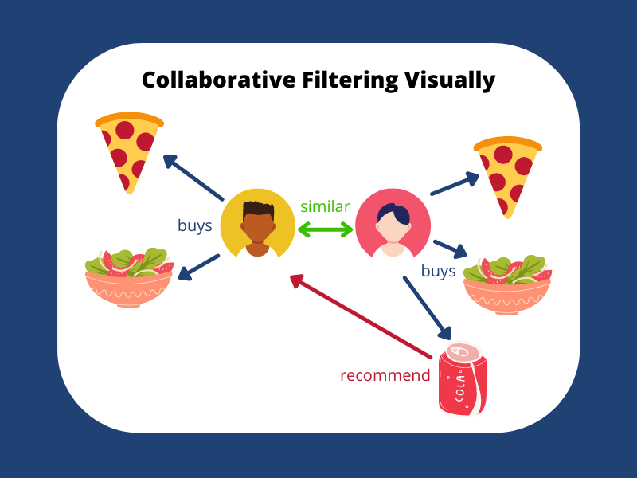
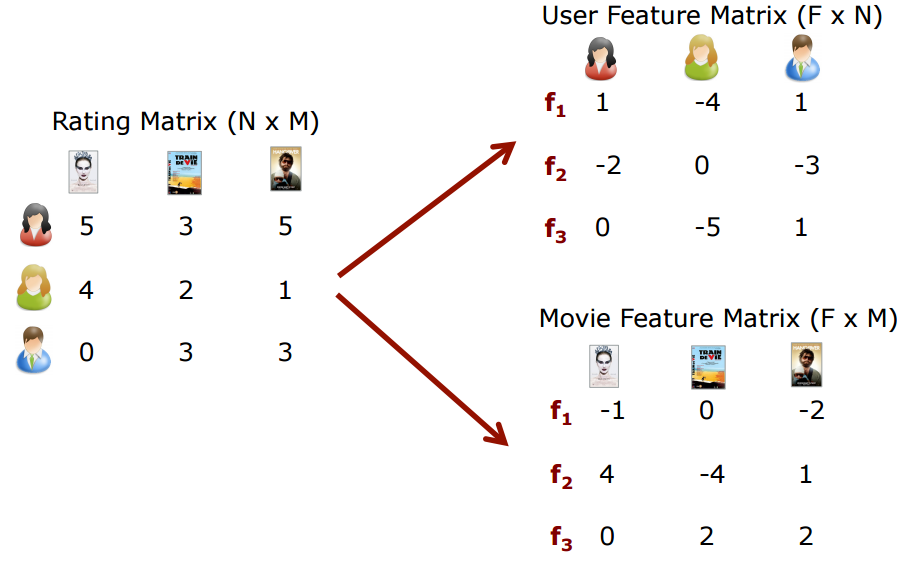
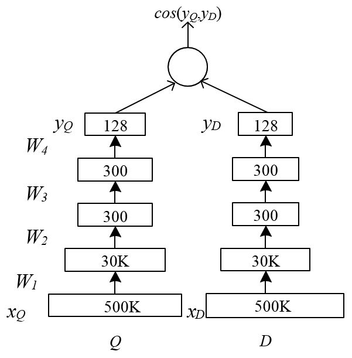
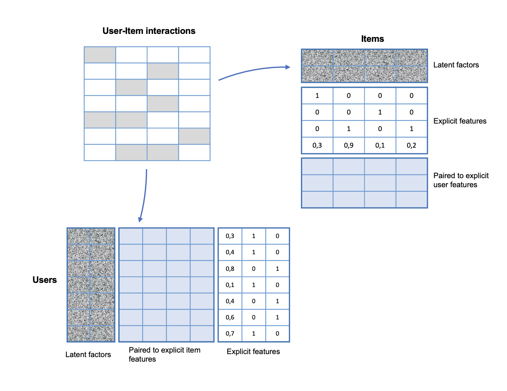
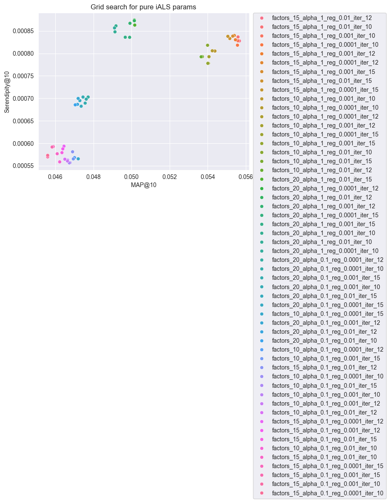

# Introduction
This work is a movie recommender system. The data is from MovieLens 100K Dataset. 

The dataset contains 100000 ratings by 943 users on 1682 items. Each user has rated at least 20 movies.

There are broadly 3 types of recommendation systems [1]:

- Popularity Based: This is a basic system in which movies/shows which are rated high will be recommended to all the users in a certain demographic region. Eg: Netflix Top Trending will show top 10 movies trending in that particular country to ever user.

- Content Based: The general idea is that if a user liked an item with certain properites then he/she are more likely to like similar items. Eg: Movies are recommended based on they Cast, Story, Genre, Plot, Director and many more fields.

- Collaborative Filtering: This is a more advanced system in which the algorithm tries to find similar users/articles and then recommends items based on this similarity. Eg: If one person likes movies A, B, and C and another person likes movies A, B, and D, it is likely that the first person will buy item D and the other person will buy item C, since they share many similarities with each other

Our work is based on Collaborative Filtering, beacuse dataset is suitable for this type of recommendation system and also we can take user's gemographic information and favorite movies into consideration in some CF methods (e.g. ALS). 

RecTools framework is used for this work [2].

# Data analysis
Some insights from the data:
- We have a lot of ratings of 4 and 5, and very few of 1 and 2. This can be a problem for recommender systems, because we don’t have enough information about the movies that users don’t like;
- Mean age of users is 34.05, and the most popular occupation is student;
- The most popular genre is Drama, and the least popular is Documentary;

For more details see [0.1_data_analysis.ipynb](../notebooks/0.1_data_analysis.ipynb).

# Models Implementation
3 models from the RecTools were tested

## SVD

Matrix decompositions are such collaborative filtering techniques. Let's imagine that we have some rating matrix. The rows are users, the columns are user-items. At the intersection of a user and an item is a number representing the interaction; zero means that the user has not interacted with the item. 

Based on such a matrix, we can describe user behavior and characteristics of aitems. For this purpose, we use spectral decomposition methods. One of them is algebraic matrix decomposition, SVD (singular value decomposition). It is based on the decomposition of the original matrix into the product of 3 other matrices:

$$ M = U \times D \times S $$

Here, U and S are the matrices of user and item feature matrix, respectively. Using these matrices, we can further obtain recommendations.

I used this model with default parameters as a baseline. It gave MAP@10 = 0.047.

One of the major disadvantages of SVD, that it solves the problem of decomposition of the original matrix directly, trying to restore all missing values by zeros. And it is an ideal solution of such a problem from the mathematical point of view. But in fact, missing values in the interaction matrix are not necessarily zeros (users may simply not have had time to interact with relevant aitems).

## DSSM

We have already understood that the relevance of an item to a user is described by the closeness of their vectors. It turns out that the search of top-k most relevant aitems is reduced to the search of k nearest neighbors (kNN).

One such model, DSSM, was invented in 2013 by researchers at Microsoft [4]. The idea behind this simple neural network is as follows: let's make two "towers" with fully connected layers and activations: one tower will be for users, the other for items.

The model learns on triplet loss.

On output, each of these towers produces embeddings of the user and the athame, and the cosine of the angle between these vectors will model the relevance of the athame to the user.

I used this model with default parameters. Model didn't train well. And it gave MAP@10 = 0.005.

It means, for our dataset, this model is not suitable. DSSM excels in scenarios where semantic understanding is crucial, such as text analysis. In the case of MovieLens, where the data is primarily numerical ratings and categorical metadata, the semantic modeling capabilities of DSSM might not be fully leveraged. DSSMs are complex models that might require extensive data to train effectively. Given the limited size and limited features of most MovieLens datasets, there's a risk of overfitting.

## ALS
ALS (alternating least squares) is a heuristic approximate algorithm for matrix decomposition. The output is again embeddings of users and eitems, with the help of which we make recommendations.

With the alternating least squares approach we use the same idea as SVD but iteratively alternate between optimizing U and fixing V and vice versa.

It is an iterative optimization process where we for every iteration try to arrive closer and closer to a factorized representation of our original data.

In pure ALS model latent factors are initialized with random values.

When we train RecTools iALS wrapper on dataset with features, we add explicit user and/or item features to embeddings. After adding some number of item explicit features to the matrix of item embeddings, we also add the same number of columns to user embeddings matrix. These added columns are user factors paired to explicit item factors. We do the same for explicit user factors and item factors paired to them.

### Training Process (Hyperparameter tuning)
I used grid search to find the best hyperparameters for ALS model.

Alphas, regularizations, factors, iterations were tuned.

The best parameters are:
- factors=15
- regularization=0.01
- alpha=1 
- iterations=12

### Evaluation
The evaluation metrics used in the recommendation system are crucial for understanding its effectiveness. 

Mean Average Precision (MAP) assesses the precision of recommendations, reflecting how well the model predicts user preferences, with higher values indicating better precision at different list lengths (1, 5, 10). 

Mean Inverse User Frequency (MIUF) measures the diversity of the recommendations, gauging how often recommended items appear in users' histories, with higher values suggesting a broader range of recommendations. 

Finally, Serendipity evaluates the element of surprise or novelty in the recommendations; lower scores in this context indicate that the recommendations are more predictable and less surprising to users. 

Collectively, these metrics provide a comprehensive picture of the recommendation system's performance, balancing precision, diversity, and the element of surprise in the suggestions it offers.

For fine-tuned hyperparameters model I got this results on test dataset:
| Metric      | @1        | @5        | @10       |
|-------------|-----------|-----------|-----------|
| MAP         | 0.02746   | 0.04436   | 0.05567   |
| MIUF        | 1.49913   | 1.65628   | 1.78369   |
| Serendipity | 0.00093   | 0.00084   | 0.00083   |

NB: My test dataset is small, so the results are not very good.

NB1: The model could recommend items that the user has already seen, but rated poorly. This is not a good recommendation. But according to the metrics, the prediction is good.

# Results and conclusion
In this work, we developed a movie recommender system using the MovieLens 100K Dataset, focusing on Collaborative Filtering (CF) techniques. Among the three models tested – SVD, DSSM, and ALS – the ALS model with hyperparameter tuning emerged as the most effective. 

The tuned ALS model showed an improvement in Mean Average Precision (MAP) at different lengths, indicating its ability to accurately predict user preferences.

Other metrics, such as Mean Inverse User Frequency (MIUF) and Serendipity, also showed positive results, suggesting that the model is able to provide a diverse range of recommendations that are not predictable or repetitive.
